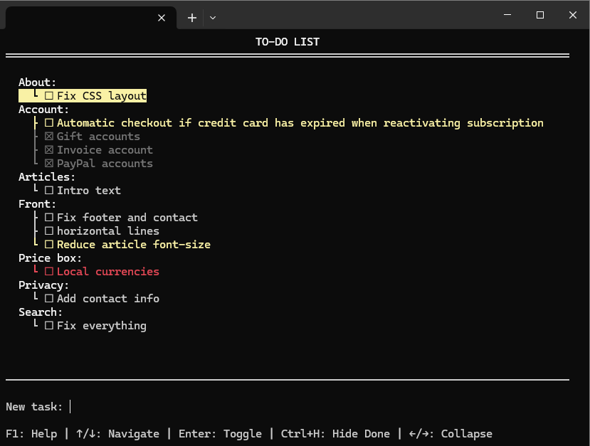

# Terminal To-do App

A fast, feature-rich terminal-based todo application built with Python and curses. Manage your tasks efficiently with grouping, priorities, collapsible sections, and multi-session support.





## Features

### Core Functionality
- **Task Management** - Create, edit, delete, and toggle completion of tasks
- **Smart Grouping** - Automatically group tasks by prefix (e.g., `Project: Task name`)
- **Priority Colors** - Mark tasks with yellow (!) or red (!!) priority indicators
- **Hide Completed** - Toggle visibility of completed tasks to focus on what's pending
- **Multi-Session Sync** - Work on the same todo list from multiple terminal sessions simultaneously

### Navigation & Organization
- **Keyboard Navigation** - Arrow keys to move through tasks and groups
- **Collapsible Groups** - Collapse/expand groups to manage long lists
- **Visual Indicators** - Completed tasks shown in gray, priorities in color
- **Tree View** - Clean hierarchical display of grouped items

### User Experience
- **Always Available** - Launch from anywhere with a simple alias
- **Input Mode** - Safe editing prevents accidental deletions
- **In-Place Editing** - Edit tasks with F2 without recreating them
- **Built-in Help** - Press F1 for complete command reference
- **Terminal Adaptive** - Works in narrow or wide terminal windows

## Installation

### Prerequisites
- Python 3.7 or higher
- Linux/macOS (uses curses, which is built-in)
- For Windows: `pip install windows-curses`

### Setup

4. **Create an alias for easy access:**
   
   Add this line to your `~/.bashrc` (or `~/.zshrc` for zsh):
   ```bash
   alias todo='python3 ~/[where you put the file]/todo.py'
   ```

5. **Reload your shell configuration:**
   ```bash
   source ~/.bashrc
   # or for zsh:
   source ~/.zshrc
   ```

Now you can launch the app from anywhere by simply typing `todo`!

## Usage

### Quick Start

Launch the app (without using an alias):
```bash
python3 todo
```
Launch the app (with an alias):
```bash
todo
```


Type a task and press **Enter** to add it. Use arrow keys to navigate and **Enter** to toggle completion.

### Creating Grouped Tasks

Use a colon (`:`) to create groups:
```
Work: Review pull requests
Work: Update documentation
Home: Buy groceries
Home: Fix leaky faucet
```

Tasks will automatically group together with a tree structure:
```
Work:
  ├ ☐ Review pull requests
  └ ☐ Update documentation
Home:
  ├ ☐ Buy groceries
  └ ☐ Fix leaky faucet
```

### Setting Priorities

While navigating the list (not in input mode):
- Press **1** - Toggle yellow priority (!)
- Press **2** - Toggle red priority (!!)
- Press **0** - Remove priority

Priorities are preserved when editing tasks.

## Keyboard Shortcuts

### Navigation
| Key | Action |
|-----|--------|
| `↑` / `↓` | Navigate through todos and groups |
| `←` | Collapse current group |
| `→` | Expand selected group |
| `TAB` | Toggle collapse/expand all groups |
| `Ctrl+H` | Toggle hide/show completed items |

### Task Operations
| Key | Action |
|-----|--------|
| `Enter` | Toggle completion (on task) / Save (when typing) |
| `Del` / `Backspace` | Delete selected task |
| `F2` | Edit selected task |

### Priorities
| Key | Action |
|-----|--------|
| `1` | Toggle yellow priority |
| `2` | Toggle red priority |
| `0` | Remove priority |

### Other
| Key | Action |
|-----|--------|
| `F1` | Show help screen |
| `ESC` | Exit app (or cancel input) |
| `Ctrl+C` | Exit app |

## Advanced Features

### Multi-Session Editing

The app supports multiple terminal sessions editing the same todo list simultaneously:
- Changes auto-sync every 500ms
- Intelligent merge prevents data loss
- Each session maintains its own view state (collapsed groups, etc.)

Perfect for working across multiple computers or terminal tabs!

### Input Mode Safety

When you start typing, the app enters "input mode" which prevents accidental task deletions when using backspace. Press `↑` or `↓` to exit input mode and return to list navigation.

### Data Storage

Todos are stored in `todos.json` in the same directory as the script. The file uses a simple JSON format:

```json
[
  {
    "id": "unique-id",
    "task": "! Work: Important task",
    "done": false
  }
]
```

You can backup or version control this file easily.

## Tips & Tricks

1. **Quick Task Entry**: Launch the app, type your task, press Enter, press ESC - all in seconds!

2. **Focus Mode**: Use `Ctrl+H` to hide completed tasks and focus on what's pending

3. **Organize Projects**: Use consistent group prefixes like `Work:`, `Personal:`, `Shopping:` for automatic organization

4. **Collapse for Overview**: Use `TAB` to collapse all groups and see a high-level overview

5. **Priority Workflow**: Add tasks without priority, then use `1` or `2` to highlight urgent items

6. **Cross-Computer Sync**: Place `todos.json` in a Dropbox/Google Drive folder and symlink to it for sync across computers

## Troubleshooting

### App won't start
- Check Python version: `python3 --version` (needs 3.7+)
- On Windows, install: `pip install windows-curses`

### Alias not working
- Make sure you reloaded your shell: `source ~/.bashrc`
- Check the path in your alias matches where you put `todo.py`

### Colors not showing
- Ensure your terminal supports 256 colors
- Try a different terminal emulator (e.g., gnome-terminal, iTerm2)

### File conflicts with multiple sessions
- The app handles this automatically - just reload if you see unexpected behavior

## Contributing

Contributions are welcome! Feel free to:
- Report bugs
- Suggest features
- Submit pull requests

## License

MIT License - feel free to use and modify as needed.

## Author

Thomas Baekdal - Baekdal.com
